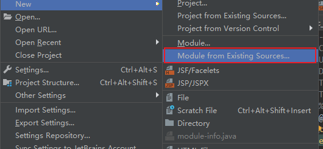
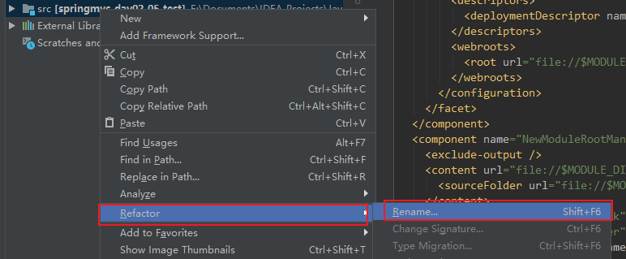
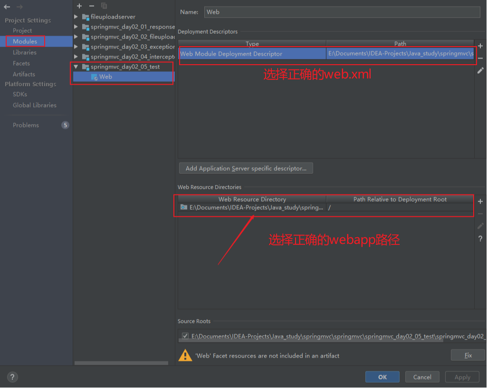

---

title:  IDEA复制一个模块
date: 2019-09-10 17:36:43
tags: 实践 教程 踩坑
---

本文主要记录学习SpringMVC过程中复制模块遇到的问题。

<!--more-->

## **学习的时候想要在IDEA上复制一个模块，但却遇到了各种问题，下面将复制模块的步骤记录一下**

* 右键要复制的模块，点击复制
* {% asset_img 1.5.1.png 这是个图片描述}

* 然后粘贴，出现一下页面，修改模块名字

* 添加模块进工程

* 选择刚才粘贴的模块

* 选择导入现有的组件

* 选择要导入的源文件，它已经找到并且默认勾选了，直接下一步

* 选择要导入的库

* 这里可以排除不想要的库，通过点击split按钮。例如：

- 然后选择不需要的库

- 然后选择筛选过的库

  

* 在这里可以选择改变module的名字，由于前面已经改过了，这里默认就好，下一步

* 按照我们平常的显示习惯，将group by改为directory，然后finish

* 修改各种项目名
  * 美观起见修改modeule路径名

  

  - 右键module

    

  - 选择修改directory

    

  - 修改目录名为module名

    

  - 修改pom.xml的<artifactID>标签

    

* 将项目部署到服务器

* 有时webapp那个文件夹没有那个小蓝点，即表示该项目不是个web项目，就不能当作一个web项目部署到服务器，这时要进行以下操作
  * 单击 file->Project Structure

  

  * 选择modules

  

箭头指的那个路径一定要对，然后点击ok就可以了

* 看似很复杂，是因为我为了说的清楚截了太多的图片，操作下来，还是比重新创建一个module快的多。

接下来，，**enjoy yourself**.