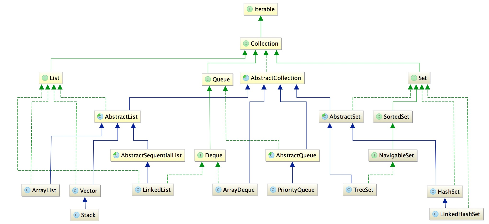

Java集合种类繁多，关系错综复杂，在此做下简单的整理。

<!--more-->

## Java集合体系结构

### 继承自Collection接口 ：List、Set和Queue

​	图中的绿色的虚线代表实现，绿色实线代表接口之间的继承，蓝色实线代表类之间的继承。

- **List（有序、可重复 双向循环表）**

​	我们用的比较多List包括ArrayList和LinkedList，这两者的区别也很明显，从其名称上就可以看出。**ArrayList的底层的通过数组实现，所以其随机访问的速度比较快，但是对于需要频繁的增删的情况，效率就比较低了。而对于LinkedList，底层通过链表来实现，所以增删操作比较容易完成，但是对于随机访问的效率比较低。**

​	至于Vector，它是ArrayList的线程安全版本，而Stack则对应栈数据结构，这两者用的比较少。

- **Queue（队列）**

  ​	一般可以直接使用LinkedList完成，从上述类图也可以看出，LinkedList继承自Deque，所以LinkedList具有双端队列的功能。PriorityQueue的特点是为每个元素提供一个优先级，优先级高的元素会优先出队列。

- **Set**

  ​	Set与List的主要区别是Set是不允许元素重复的，而List则可以允许元素重复的。判断元素的重复需要根据对象的hash方法和equals方法来决定。这也是我们通常要为集合中的元素类重写hashCode方法和equals方法的原因。

  ​	元素加入List的时候，不执行额外的操作，并且可以重复。而加入Set之前需要先执行hashCode方法，如果返回的值在集合中已存在，则要继续执行equals方法，如果equals方法返回的结果也为真，则证明该元素已经存在，会将新的元素覆盖老的元素，如果返回hashCode值不同，则直接加入集合。这里记住一点，对于集合中元素，hashCode值不同的元素一定不相等，但是不相等的元素，hashCode值可能相同。

### 继承自Map



​	Map类型的集合最大的优点在于其查找效率比较高，理想情况下可以实现O(1)的时间复杂度。Map中最常用的是HashMap，LinkedHashMap与HashMap的区别在于前者能够保证插入集合的元素顺序与输出顺序一致。这两者与TreeMap的区别在于TreeMap是根据键值进行排序的，当然其底层的实现也有本质的区别，如HashMap底层是一个哈希表，而TreeMap的底层数据结构是一棵树。

## note

- #### Java集合类中存储的仅仅是对象的引用，并不存储对象本身，集合类的容量可以在运行期间进行动态扩展。

- #### 关于hashcode

  ​	想要弄明白hashCode的作用，必须要先知道Java中的集合。　　
  ​       总的来说，Java中的集合（Collection）有两类，一类是List，再有一类是Set。前者集合内的元素是有序的，元素可以重复；后者元素无序，但元素不可重复。这里就引出一个问题：要想保证元素不重复，可两个元素是否重复应该依据什么来判断呢？
  ​        这就是Object.equals方法了。但是，如果每增加一个元素就检查一次，那么当元素很多时，后添加到集合中的元素比较的次数就非常多了。也就是说，如果集合中现在已经有1000个元素，那么第1001个元素加入集合时，它就要调用1000次equals方法。这显然会大大降低效率。   
  ​       于是，Java采用了哈希表的原理。哈希（Hash）实际上是个人名，由于他提出一哈希算法的概念，所以就以他的名字命名了。哈希算法也称为散列算法，是将数据依特定算法直接指定到一个地址上，初学者可以简单理解，hashCode方法实际上返回的就是对象存储的物理地址（实际可能并不是）。  
  ​       这样一来，当集合要添加新的元素时，先调用这个元素的hashCode方法，就一下子能定位到它应该放置的物理位置上。如果这个位置上没有元素，它就可以直接存储在这个位置上，不用再进行任何比较了；如果这个位置上已经有元素了，就调用它的equals方法与新元素进行比较，相同的话就不存了，不相同就散列其它的地址。所以这里存在一个冲突解决的问题。这样一来实际调用equals方法的次数就大大降低了，几乎只需要一两次。  

   简而言之，在集合查找时，hashcode能大大降低对象比较次数，提高查找效率！

  Java对象的eqauls方法和hashCode方法是这样规定的：

  1、相等（相同）的对象必须具有相等的哈希码（或者散列码）。

  2、如果两个对象的hashCode相同，它们并不一定相同。

- #### 除了上述类，集合还提供Collections和Arrays两个工具类，此外，集合中排序跟Comparable和Comparator紧密相关。