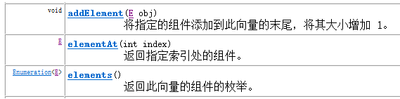

本文主要记录Collection中的常用几个子类（List集合、Set集合）。

<!--more-->

# 第1章 **List接口**

## 1.1 **List接口介绍**

查阅API，看List的介绍。有序的 collection（也称为序列）。此接口的用户可以对列表中每个元素的插入位置进行精确地控制。用户可以根据元素的整数索引（在列表中的位置）访问元素，并搜索列表中的元素。与 set 不同，列表通常允许重复的元素。

看完API，我们总结一下：

List接口：

l 它是一个元素存取有序的集合。例如，存元素的顺序是11、22、33。那么集合中，元素的存储就是按照11、22、33的顺序完成的）。

l 它是一个带有索引的集合，通过索引就可以精确的操作集合中的元素（与数组的索引是一个道理）。

l 集合中可以有重复的元素，通过元素的equals方法，来比较是否为重复的元素。

 

List接口的常用子类有：

l ArrayList集合

l LinkedList集合

## 1.2 **List接口中常用的方法**

 

 

l 增加元素方法

l add(Object e)：向集合末尾处，添加指定的元素

l add(int index, Object e)：向集合指定索引处，添加指定的元素，原有元素依次后移

l 删除元素删除

l remove(Object e)：将指定元素对象，从集合中删除，返回值为被删除的元素

l remove(int index)：将指定索引处的元素，从集合中删除，返回值为被删除的元素

l 替换元素方法

l set(int index, Object e)：将指定索引处的元素，替换成指定的元素，返回值为替换前的元素

l 查询元素方法

l get(int index)：获取指定索引处的元素，并返回该元素

 

方法演示：

List<String> list = **new** ArrayList<String>();

//1,添加元素。

list.add("小红");

list.add("小梅");

list.add("小强");

//2,插入元素。插入元素前的集合["小红","小梅","小强"]

list.add(1, "老王"); //插入元素后的集合["小红","老王","小梅","小强"]

//3,删除元素。

list.remove(2);// 删除元素后的集合["小红","老王","小强"]

//4,修改元素。

list.set(1, "隔壁老王");// 修改元素后的集合["小红","隔壁老王","小强"]

 

Iterator<String> it = list.iterator();

**while** (it.hasNext()) {

String str = it.next();

System.*out*.println(str);

}

由于List集合拥有索引，因此List集合迭代方式除了使用迭代器之外，还可以使用索引进行迭代。

**for** (**int** i = 0; i < list.size(); i++) {

String str = list.get(i);

System.*out*.println(str);

}

 

### 1.2.1 **Iterator的并发修改异常**

在list集合迭代元素中，对元素进行判断，一旦条件满足就添加一个新元素。代码如下

**public** **class** IteratorDemo {

//在list集合迭代元素中，对元素进行判断，一旦条件满足就添加一个新元素

**public** **static** **void** main(String[] args) {

//创建List集合

List<String> list = **new** ArrayList<String>();

//给集合中添加元素

list.add("abc1");

list.add("abc2");

list.add("abc3");

list.add("abc4");

//迭代集合，当有元素为"abc2"时，集合加入新元素"itcast"

Iterator<String> it = list.iterator();

**while**(it.hasNext()){

String str = it.next();

//判断取出的元素是否是"abc2"，是就添加一个新元素

**if**("abc2".equals(str)){

list.add("itcast");// 该操作会导致程序出错

}

}

//打印容器中的元素

System.*out*.println(list);

}

}

运行上述代码发生了错误 java.util.ConcurrentModificationException这是什么原因呢？

在迭代过程中，使用了集合的方法对元素进行操作。导致迭代器并不知道集合中的变化，容易引发数据的不确定性。

并发修改异常解决办法：在迭代时，不要使用集合的方法操作元素。

那么想要在迭代时对元素操作咋办？通过ListIterator迭代器操作元素是可以的，ListIterator的出现，解决了使用Iterator迭代过程中可能会发生的错误情况。

 

## 1.3 **List集合存储数据的结构**

List接口下有很多个集合，它们存储元素所采用的结构方式是不同的，这样就导致了这些集合有它们各自的特点，供给我们在不同的环境下进行使用。数据存储的常用结构有：堆栈、队列、数组、链表。我们分别来了解一下：

l 堆栈，采用该结构的集合，对元素的存取有如下的特点：

l 先进后出（即，存进去的元素，要在后它后面的元素依次取出后，才能取出该元素）。例如，子弹压进弹夹，先压进去的子弹在下面，后压进去的子弹在上面，当开枪时，先弹出上面的子弹，然后才能弹出下面的子弹。

l 栈的入口、出口的都是栈的顶端位置

l 压栈：就是存元素。即，把元素存储到栈的顶端位置，栈中已有元素依次向栈底方向移动一个位置。

l 弹栈：就是取元素。即，把栈的顶端位置元素取出，栈中已有元素依次向栈顶方向移动一个位置。

 

 

 

l 队列，采用该结构的集合，对元素的存取有如下的特点：

l 先进先出（即，存进去的元素，要在后它前面的元素依次取出后，才能取出该元素）。例如，安检。排成一列，每个人依次检查，只有前面的人全部检查完毕后，才能排到当前的人进行检查。

l 队列的入口、出口各占一侧。例如，下图中的左侧为入口，右侧为出口。

 

 

 

l 数组，采用该结构的集合，对元素的存取有如下的特点：

l 查找元素快：通过索引，可以快速访问指定位置的元素

l 增删元素慢：

l **指定索引位置增加元素**：需要创建一个新数组，将指定新元素存储在指定索引位置，再把原数组元素根据索引，复制到新数组对应索引的位置。如下图

l **指定索引位置删除元素：**需要创建一个新数组，把原数组元素根据索引，复制到新数组对应索引的位置，原数组中指定索引位置元素不复制到新数组中。如下图

 

 

 

l 链表，采用该结构的集合，对元素的存取有如下的特点：

l 多个节点之间，通过地址进行连接。例如，多个人手拉手，每个人使用自己的右手拉住下个人的左手，依次类推，这样多个人就连在一起了。

l 查找元素慢：想查找某个元素，需要通过连接的节点，依次向后查找指定元素

l 增删元素快：

l 增加元素：操作如左图，只需要修改连接下个元素的地址即可。

l 删除元素：操作如右图，只需要修改连接下个元素的地址即可。

 

 

 

## 1.4 **ArrayList集合**

ArrayList集合数据存储的结构是数组结构。元素增删慢，查找快，由于日常开发中使用最多的功能为查询数据、遍历数据，所以ArrayList是最常用的集合。

许多程序员开发时非常随意地使用ArrayList完成任何需求，并不严谨，这种用法是不提倡的。

## 1.5 **LinkedList集合**

LinkedList集合数据存储的结构是链表结构。方便元素添加、删除的集合。实际开发中对一个集合元素的添加与删除经常涉及到首尾操作，而LinkedList提供了大量首尾操作的方法。如下图

 

 

 

LinkedList是List的子类，List中的方法LinkedList都是可以使用，这里就不做详细介绍，我们只需要了解LinkedList的特有方法即可。在开发时，LinkedList集合也可以作为堆栈，队列的结构使用。

方法演示：

LinkedList<String> link = **new** LinkedList<String>();

//添加元素

link.addFirst("abc1");

link.addFirst("abc2");

link.addFirst("abc3");

//获取元素

System.*out*.println(link.getFirst());

System.*out*.println(link.getLast());

//删除元素

System.*out*.println(link.removeFirst());

System.*out*.println(link.removeLast());

 

**while**(!link.isEmpty()){ //判断集合是否为空

System.*out*.println(link.pop()); //弹出集合中的栈顶元素

​       }

## 1.6 **Vector集合**

Vector集合数据存储的结构是数组结构，为JDK中最早提供的集合。Vector中提供了一个独特的取出方式，就是枚举Enumeration，它其实就是早期的迭代器。此接口Enumeration的功能与 Iterator 接口的功能是类似的。Vector集合已被ArrayList替代。枚举Enumeration已被迭代器Iterator替代。

l Vector常见的方法：

 

 

l Enumeration枚举常见的方法：

 

 

l Vector集合对ArrayList集合使用的对比

 

 

# 第2章 **Set接口**

学习Collection接口时，记得Collection中可以存放重复元素，也可以不存放重复元素，那么我们知道List中是可以存放重复元素的。那么不重复元素给哪里存放呢？那就是Set接口，它里面的集合，所存储的元素就是不重复的。

## 2.1 **Set接口介绍**

查阅Set集合的API介绍，通过元素的equals方法，来判断是否为重复元素，

## 2.2 **HashSet集合介绍**

查阅HashSet集合的API介绍：此类实现Set接口，由哈希表支持（实际上是一个 HashMap集合）。HashSet集合不能保证的迭代顺序与元素存储顺序相同。

HashSet集合，采用哈希表结构存储数据，保证元素唯一性的方式依赖于：hashCode()与equals()方法。

## 2.3 **HashSet集合存储数据的结构（哈希表）**

什么是哈希表呢？

哈希表底层使用的也是数组机制，数组中也存放对象，而这些对象往数组中存放时的位置比较特殊，当需要把这些对象给数组中存放时，那么会根据这些对象的特有数据结合相应的算法，计算出这个对象在数组中的位置，然后把这个对象存放在数组中。而这样的数组就称为哈希数组，即就是哈希表。

当向哈希表中存放元素时，需要根据元素的特有数据结合相应的算法，这个算法其实就是Object类中的hashCode方法。由于任何对象都是Object类的子类，所以任何对象有拥有这个方法。即就是在给哈希表中存放对象时，会调用对象的hashCode方法，算出对象在表中的存放位置，这里需要注意，如果两个对象hashCode方法算出结果一样，这样现象称为哈希冲突，这时会调用对象的equals方法，比较这两个对象是不是同一个对象，如果equals方法返回的是true，那么就不会把第二个对象存放在哈希表中，如果返回的是false，就会把这个值存放在哈希表中。

总结：保证HashSet集合元素的唯一，其实就是根据对象的hashCode和equals方法来决定的。如果我们往集合中存放自定义的对象，那么保证其唯一，就必须复写hashCode和equals方法建立属于当前对象的比较方式。

 

 

## 2.4 **HashSet存储JavaAPI中的类型元素**

给HashSet中存储JavaAPI中提供的类型元素时，不需要重写元素的hashCode和equals方法，因为这两个方法，在JavaAPI的每个类中已经重写完毕，如String类、Integer类等。

l 创建HashSet集合，存储String对象。

**public** **class** HashSetDemo {

**public** **static** **void** main(String[] args) {

//创建HashSet对象

HashSet<String> hs = **new** HashSet<String>();

//给集合中添加自定义对象

hs.add("zhangsan");

hs.add("lisi");

hs.add("wangwu");

hs.add("zhangsan");

//取出集合中的每个元素

Iterator<String> it = hs.iterator();

**while**(it.hasNext()){

String s = it.next();

System.*out*.println(s);

}

}

}

输出结果如下，说明集合中不能存储重复元素：

wangwu

lisi

zhangsan

## 2.5 **HashSet存储自定义类型元素**

给HashSet中存放自定义类型元素时，需要重写对象中的hashCode和equals方法，建立自己的比较方式，才能保证HashSet集合中的对象唯一

l 创建自定义对象Student

**public** **class** Student {

**private** String name;

**private** **int** age;

**public** Student(String name, **int** age) {

**super**();

**this**.name = name;

**this**.age = age;

}

**public** String getName() {

**return** name;

}

**public** **void** setName(String name) {

**this**.name = name;

}

**public** **int** getAge() {

**return** age;

}

**public** **void** setAge(**int** age) {

**this**.age = age;

}

@Override

**public** String toString() {

**return** "Student [name=" + name + ", age=" + age + "]";

}

@Override

**public** **int** hashCode() {

**final** **int** prime = 31;

**int** result = 1;

result = prime * result + age;

result = prime * result + ((name == **null**) ? 0 : name.hashCode());

**return** result;

}

@Override

**public** **boolean** equals(Object obj) {

**if** (**this** == obj)

**return** **true**;

**if**(!(obj **instanceof** Student)){

**System.out.println(**"类型错误"**)**;

**return** **false**;

}

Student other = (Student) obj;

**return** **this**.age ==  other.age && **this**.name.equals(other.name);

}

}

 

l 创建HashSet集合，存储Student对象。

**public** **class** HashSetDemo {

**public** **static** **void** main(String[] args) {

//创建HashSet对象

HashSet hs = **new** HashSet();

//给集合中添加自定义对象

hs.add(**new** Student("zhangsan",21));

hs.add(**new** Student("lisi",22));

hs.add(**new** Student("wangwu",23));

hs.add(**new** Student("zhangsan",21));

//取出集合中的每个元素

Iterator it = hs.iterator();

**while**(it.hasNext()){

Student s = (Student)it.next();

System.*out*.println(s);

}

}

}

输出结果如下，说明集合中不能存储重复元素：

Student [name=lisi, age=22]

Student [name=zhangsan, age=21]

Student [name=wangwu, age=23]

## 2.6 **LinkedHashSet介绍**

我们知道HashSet保证元素唯一，可是元素存放进去是没有顺序的，那么我们要保证有序，怎么办呢？

在HashSet下面有一个子类LinkedHashSet，它是链表和哈希表组合的一个数据存储结构。

演示代码如下：

**public** **class** LinkedHashSetDemo {

**public** **static** **void** main(String[] args) {

Set<String> set = **new** LinkedHashSet<String>();

set.add("bbb");

set.add("aaa");

set.add("abc");

set.add("bbc");

Iterator it = set.iterator();

**while** (it.hasNext()) {

System.*out*.println(it.next());

}

}

}

输出结果如下，LinkedHashSet集合保证元素的存入和取出的顺序：

bbb

aaa

abc

bbc

 

# 第3章 **判断集合元素唯一的原理**

## 3.1 **ArrayList的contains方法判断元素是否重复原理**

 

 

ArrayList的contains方法会使用调用方法时，传入的元素的equals方法依次与集合中的旧元素所比较，从而根据返回的布尔值判断是否有重复元素。此时，当ArrayList存放自定义类型时，由于自定义类型在未重写equals方法前，判断是否重复的依据是地址值，所以如果想根据内容判断是否为重复元素，需要重写元素的equals方法。

## 3.2 **HashSet的add/contains等方法判断元素是否重复原理**

 

 

Set集合不能存放重复元素，其添加方法在添加时会判断是否有重复元素，有重复不添加，没重复则添加。

HashSet集合由于是无序的，其判断唯一的依据是元素类型的hashCode与equals方法的返回结果。规则如下：

先判断新元素与集合内已经有的旧元素的HashCode值

l 如果不同，说明是不同元素，添加到集合。

l 如果相同，再判断equals比较结果。返回true则相同元素；返回false则不同元素，添加到集合。

所以，使用HashSet存储自定义类型，如果没有重写该类的hashCode与equals方法，则判断重复时，使用的是地址值，如果想通过内容比较元素是否相同，需要重写该元素类的hashcode与equals方法。

# 第4章 **总结**

## 4.1 **知识点总结**

l List与Set集合的区别？

List:

  它是一个有序的集合(元素存与取的顺序相同)

  它可以存储重复的元素

  Set:

  它是一个无序的集合(元素存与取的顺序可能不同)

  它不能存储重复的元素

l List集合中的特有方法

l void add(int index, Object element) 将指定的元素，添加到该集合中的指定位置上

l Object get(int index)返回集合中指定位置的元素。

l Object remove(int index) 移除列表中指定位置的元素, 返回的是被移除的元素

l Object set(int index, Object element)用指定元素替换集合中指定位置的元素,返回值的更新前的元素

l ArrayList:

底层数据结构是数组，查询快，增删慢

l LinkedList:

底层数据结构是链表，查询慢，增删快

l HashSet:

元素唯一，不能重复

底层结构是 哈希表结构

元素的存与取的顺序不能保证一致

如何保证元素的唯一的？

重写hashCode() 与 equals()方法

l LinkedHashSet:

元素唯一不能重复

底层结构是 哈希表结构 + 链表结构

元素的存与取的顺序一致

## enjoy yourself !