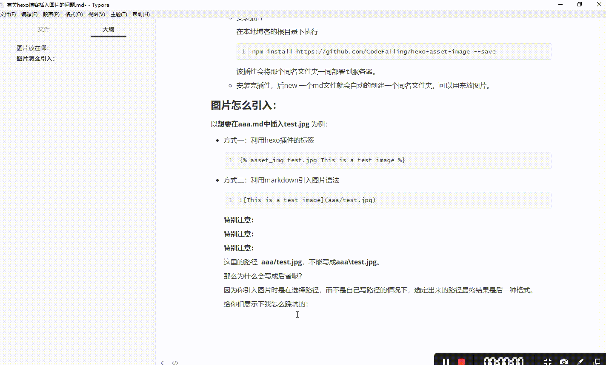
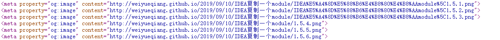
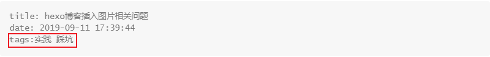
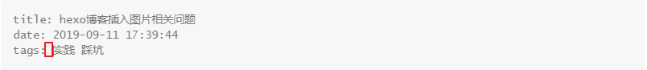

本文主要介绍利用hexo搭建的博客插入图片的一系列问题，以及注意事项。

<!--more-->

## 图片放在哪：

- 方式一：创建一个专门的图片仓库

  在github上面创建一个仓库专门存放图片，markdown文件插入的图片路径直接写网络路径

  这种方法加载缓慢，但是图片上传到云端，随处可以访问，不会出现一些路径错误，找不到资源等。

- 方式二：hexo插件（推荐）

  - 修改_config.yml文件

    在本地博客的根目录下有个**_config.yml**文件，修改其中的**post_asset_folder**属性为**true**.

    这一步的目的是，你在通过hexo n xxxx.md创建新文件时，hexo会在相同的文件夹下自动的为你创建一个同名文件夹，里面可以放你的markdown文件需要的一些静态文件。

  - 安装插件

    在本地博客的根目录下执行

    ```git bash
    npm install https://github.com/CodeFalling/hexo-asset-image --save  
    ```

    该插件会将那个同名文件夹一同部署到服务器。

  - 安装完插件，后new 一个md文件就会自动的创建一个同名文件夹，可以用来放图片。

## 图片怎么引入：

以**想要在aaa.md中插入test.jpg** 为例：

- 方式一：利用hexo插件的标签

  ```
  
  ```

  下面图片就是用这种方法引入：

  

- 方式二：利用markdown引入图片语法

  ```md
  
  ```

  下面方式就是用这种方法引入：

  

  **特别注意：**

  **特别注意：**

  **特别注意：**

  这里的路径  **aaa/test.jpg**，不能写成**aaa\test.jpg**。

  那么为什么会写成后者呢？

  因为你引入图片时是在选择路径，而不是自己写路径的情况下，选定出来的路径最终结果是后一种格式。

  给你们展示下我怎么踩坑的：

  

  哈哈，公开处刑。不过以后就记得了。

  **原因：**

  “\"不行的原因是hexo部署的时候，会把他当作转移字符的开头，出现一通乱码，截取部署后的部分网页源代码，前三个标签就是因为用的”\“，导致图片不能显示，后面三个标签就是用的”/“，图片可以正常显示。

  

## 生成本blog时踩到的新坑

* 问题：

  ```git
  hexo g
  ```

  文档编辑完成后，使用生成命令进行生成，在public文件夹中没有生成的html。

* 解决：

  这个问题真是棘手，我用控制变量法一个点一个点的测试了一下午，最终发现是**一个空格的问题**。

  * 错误：

    

  * 正确：

    


## enjoy yourself !