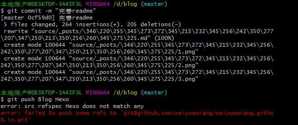

这个问题困扰了我一天，真大坑

<!--more-->

* 问题重现

  我在一个新文件夹`git init`了一个本地仓库，把我远程仓库Blog的Hexo分支pull下来，然后改了几个文件，git commit 可以成功，但是git push 出错。

  如下：

  

- 问题分析与解决

  在进行git push 的时候，需要确定2个事情。
  1、本地分支和远程分支是否有关联
  2、本地分支的名称和远程分支的名称是否一致。

  如果本地分支和远程分支没有关联，那么最好关联上(可以通过`git branch -avv`命令来查看)，因为这样在后续方面进行查找关联关系，如果多个功能并行开发的话，会产生找不到对应分支的问题。

  当本地分支和远程分支有关联关系的时候，这时候要看本地分支和远程分支是否名称相同。
  如果名称相同，那么可以直接这样提交 git push 如果名称不同，需要这样提交

  ```bash
  git push Blog master:Hexo
  ```

  或者可以同时将本地和远程分支关联：

  ```
  git push --set-upstream Blog master:Hexo
  ```

  或者可以创建分支时就将他们关联：

  ```
  git checkout -b newdev Blog/Hexo
  ```

  **当然，如果你能保持远程和本地分支名相同的话，就没有这些p事了。**

  

  [参考链接](https://blog.csdn.net/wild46cat/java/article/details/80148148)

  